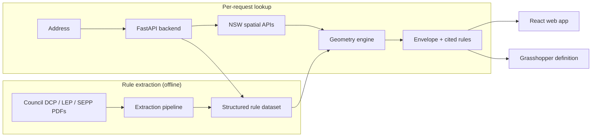

# PlanCheck — Automated NSW Planning Compliance Checker

Turns a residential address into a buildable envelope and a cited list of the planning rules
that produced it, either as a web app or as real geometry inside Rhino through a companion
Grasshopper definition.

## The problem

Before designing a house in NSW, you need to know what's actually allowed on the site: how far
back from each boundary, how tall, how much of the lot can be covered. That information is split
across a Local Environmental Plan, a council Development Control Plan, one or more State
Environmental Planning Policies, and several live government GIS map layers. A council's own
numbers can also be overridden by state policy depending on exactly where the lot sits. Working
this out today means manually cross-referencing all of it.

PlanCheck automates that lookup. It geocodes the address, pulls the real cadastral boundary and
zoning from NSW's own spatial data, matches the applicable rules, and computes the buildable
envelope, with every figure traced back to its clause and page number in the source document.
Results are available as an interactive map in the browser, or as 3D geometry in Rhino via a
companion Grasshopper definition.

## What it does

- Enter a residential address and get a map of the lot with the setback-clipped buildable
  envelope drawn over live satellite/cadastral imagery.
- Every rule shown links back to its source clause, page number, and an exact quote from the
  DCP/LEP PDF it came from.
- Floor space ratio, height limits, minimum lot size, and heritage status are queried live from
  NSW Planning's spatial map layers rather than read only from DCP text, since some of these
  vary by map area in ways a document alone won't capture.
- A separate check screens eligibility against the Complying Development Certificate codes and
  the state's Low/Mid-Rise housing policy, so a faster approval pathway can be ruled in or out
  before anyone invests in a full design.
- A Grasshopper definition pulls the same data into Rhino and extrudes the buildable envelope
  into a 3D mass for modelling.
- Rule extraction is LLM-assisted: it detects each council document's own formatting
  conventions, chunks it with section context, and extracts structured numeric rules, instead of
  a hand-written parser per council.

## How it works



1. Offline, per council: planning PDFs go through an extraction pipeline that detects that
   document's own clause-labelling and heading conventions, chunks it with full section context,
   then extracts numeric standards — setbacks, height, floor space ratio, landscaping, parking,
   fencing, and more.
2. At request time, the backend geocodes the address, pulls the lot boundary and zoning live
   from NSW's spatial APIs, matches the applicable rules for that zone and dwelling type, and
   computes the buildable envelope by clipping the lot polygon with the correct setback on each
   edge.
3. The result is a GeoJSON envelope plus a citation list, used by the web app or the Grasshopper
   definition.

## Tech stack

| Layer | Technology |
|---|---|
| Backend API | Python, FastAPI, Shapely, Requests |
| Rule extraction pipeline | PyMuPDF, Gemini / Groq |
| Frontend | React, Vite, react-leaflet |
| 3D integration | Rhino / Grasshopper |
| Data sources | NSW Government spatial APIs (geocoding, cadastre, zoning, FSR/height/heritage map layers) |

## Project structure

```
backend/            FastAPI service — see backend/README.md
frontend/           React + Vite web app
pipeline.py          DCP/LEP/SEPP rule extraction pipeline
pipeline_manifest.json   Which councils/documents the pipeline processes
data/                Extracted rule sets, cached lookups, ground-truth test data
docs/                Source planning PDFs
grasshopper_plugin.py    Reference copy of the code in the Grasshopper definition
RhinoPlugInV1.gh     The Grasshopper definition — see GRASSHOPPER_PLUGIN.md
ACCURACY.md          Extraction accuracy report against verified ground-truth addresses
```

See [backend/README.md](backend/README.md) for API docs, setup, and scope/limitations, and
[GRASSHOPPER_PLUGIN.md](GRASSHOPPER_PLUGIN.md) for the Rhino/Grasshopper integration.

## Getting started

```powershell
# Backend
pip install -r requirements.txt
uvicorn backend.main:app --reload --port 8000

# Frontend (separate terminal)
cd frontend
npm install
npm run dev
```

Full setup, environment variables, and API reference are in
[backend/README.md](backend/README.md). To use the Grasshopper definition instead of, or
alongside, the web app: start the backend as above, then open `RhinoPlugInV1.gh` in Rhino — see
[GRASSHOPPER_PLUGIN.md](GRASSHOPPER_PLUGIN.md).

## Current scope

Currently focused on Canada Bay Council, NSW (zones R1–R4). The extraction pipeline is built to
generalise to other councils' documents, but only Canada Bay is wired up right now. Some
standards are left unresolved rather than approximated — a small number of setback/height
figures that a council's DCP defines qualitatively (matched to the surrounding streetscape)
rather than as a fixed number are surfaced as an explicit gap instead of a guess. Full accuracy
report and known limitations: [ACCURACY.md](ACCURACY.md), [backend/README.md](backend/README.md).

## Team

Manasvi Menon — backend, extraction pipeline, geometry engine, API. See
[backend/README.md](backend/README.md).

Hanisha Pulimaddi — Rhino/Grasshopper integration. See
[GRASSHOPPER_PLUGIN.md](GRASSHOPPER_PLUGIN.md).
